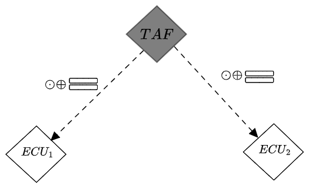
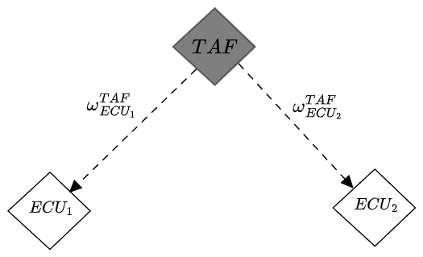

# TAF Brussels Demonstrator

We will have to show the demo on April 24 in Brussels. We should have both a *video of the TAF* as well as the *live demo* to show. 

The demo is to include the following components: 

- full standalone **TAF**, 
- **trust model** representing the in-vehicle scenario, 
- integration of **intrusion detection system** as a trust source, 
- integration of at least one **other static trust source** such as secure boot. 

> Note: There will be other demos about MBD, TEE/Gramine, in-vehicle migration, and potentially other things, but we are not expecting all this to be integrated.

##### Storyline

The **C-ACC** application is running on VC1 / ECU1. The Trust Assessment Framework has the task of assessing the trustworthiness of VC1 / ECU1 w.r.t. not compromising the output of the C-ACC application during execution. For this, the TAF is collecting trustworthiness evidence from three trust sources: 1) secure boot, 2) intrusion detection system, and 3) dynamic control flow integrity. Initially, Trust Assessment Framework receives only positive evidence from these trust sources, and, as a result, trusts that the VC1 / ECU1 will not compromise the output of the C-ACC function. This mean that the Actual Trustworthiness Level (**ATL**) of the VC1 / ECU1 which TAF calculated is initially **greater** than its Required Trustworthiness Level (**RTL**). 

However, at some point during run-time, the VC1 / ECU1 is compromised and, as a result, one of the intrusion detection system provides negative evidence. This results in the **ATL** of VC1 / ECU1 dropping and becoming **smaller** than the **RTL**. Therefore, VC1 / ECU1 is no longer trusted by the TAF to not compromise the output of the C-ACC function. As a consequence, the C-ACC application will be migrated to another VC / ECU that is trusted by the TAF in order for the application to continue running.

From the TAF's perspective the following events would take place from time = 0 onwards:

1.  **TAF initialized**
		- Trust Model Instance for the use-case is instantiated based on a Trust Model Template ("a single struct template") and a table is printed to the console:

Fig 1. - Trust Model Template for C-ACC in-vehicle use-case

Fig 2. - Trust Model Instance for C-ACC in-vehicle use-case

| ID  | Trustor | Trustee | $\omega^{Trustor}_{Trustee}$ | Timestamp | $ATO_1$                        | $ATO_2$                        |
| --- | ------- | ------- | ---------------------------- | --------- | ------------------------------ | ------------------------------ |
| ID1 | TAF     | ECU1    | $(0,0,1)$                    | $t_1$     | $\omega^{TAF}_{ECU_1 \| TS_1}$ | $\omega^{TAF}_{ECU_1 \| TS_2}$ |
| ID2 | TAF     | ECU2    | $(0,0,1)$                    | $t_2$     | $\omega^{TAF}_{ECU_2 \| TS_1}$ | $\omega^{TAF}_{ECU_2 \| TS_2}$ |

Table 1 - Table that is printed to the console of the demo and refreshed when needed

2. **Evidence arrives**
	- [ ] ~~Kafka will be used and needs to be implemented~~
	- [ ] We will create a text file that will represent messages with evidence
	- [ ] Evidence message format needs to be decided on, but booleans will be used to indicate whether evidence is negative or positive, one suggestion:
		- trustee_ID: numeric value, trust_source_ID: numeric value, evid_type: boolean

3. **TSM converts evidence** into an atomic trust opinion
	- [ ] A [method](Trust_Sources_Conversion.md) for converting evidence to an ATO needs to be implemented
		
4. **TAM receives a change-event from TSM** with latest opinions to be reflected in the TMI
	 - [ ] Implement this with go-routines and go-channels?

5. **TAM updates the TMI** by writing the TOs to it in appropriate locations
6. **TAM runs the TLEE** to compute ATL where needed 
7. **TLEE computes the ATL** - in this case the ATL will be equal to a trust opinion attached to a trust relationship as this is a very simple trust model that does not require fusion or trust discounting ($ATL_1  = \omega^{TAF}_{ECU_1}$, $ATL_2 = \omega^{TAF}_{ECU_2}$)
8. **TLEE returns ATLs** to the TAM
9. **TAM runs TDE**
10. **TDE computes TDs**
11. **TDE returns TDs**
12. **TAM stores the TDs**
